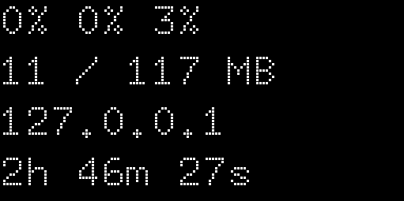

# HC4 OLED Notifier

This application provides simple statistics for [ODROID-HC4 with OLED] device.

[ODROID-HC4 with OLED]: https://www.hardkernel.com/shop/odroid-hc4-oled/


Currently there are no options and the device used (`/dev/i2c-0`) and
rotation (180 degrees) is hardcoded to match HC4 OLED's display. The
display is refreshed every 2 seconds.

## Building

```sh
cargo build --bin main --target aarch64-unknown-linux-musl --release
```

## Running

If there are no `/dev/i2c-0` device use the kernel module: `modprobe
i2c-dev`.

## Installing

Currently the notifier is available on Arch AUR:
https://aur.archlinux.org/packages/oled-notifier-git

Note that the package can be built on amd64 systems but must be run on
AArch64 system.

## End-to-end tests

The end-to-end tests render a frame using fake system statistics and
check if the image is consistent with the known-good output:



To regenerate end-to-end screenshots run the following command:

```sh
EG_SIMULATOR_DUMP=docs/screenshot.png cargo run --features simulator --bin simulate
```

## See also

  - [sys-oled-hc4](https://github.com/rpardini/sys-oled-hc4) for more
    features (Python).
